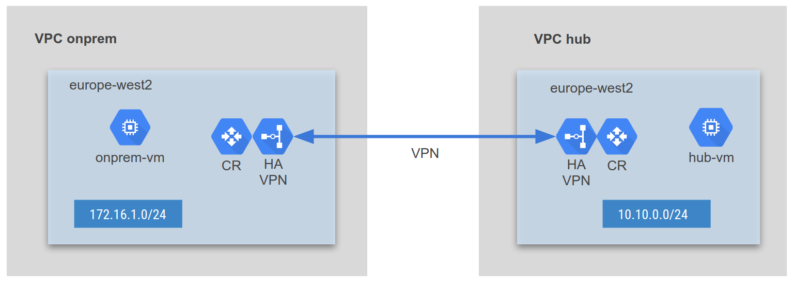

# HA VPN: GCP to GCP

This terraform code deploys 2 x VPCs and sets up HA VPN between them.



## Deploy

Run the following commands to deploy the infrastructure:
```hcl
terraform init
terraform plan
terraform apply
```
To destroy the infrastructure, run the command
```hcl
terraform destroy
```
