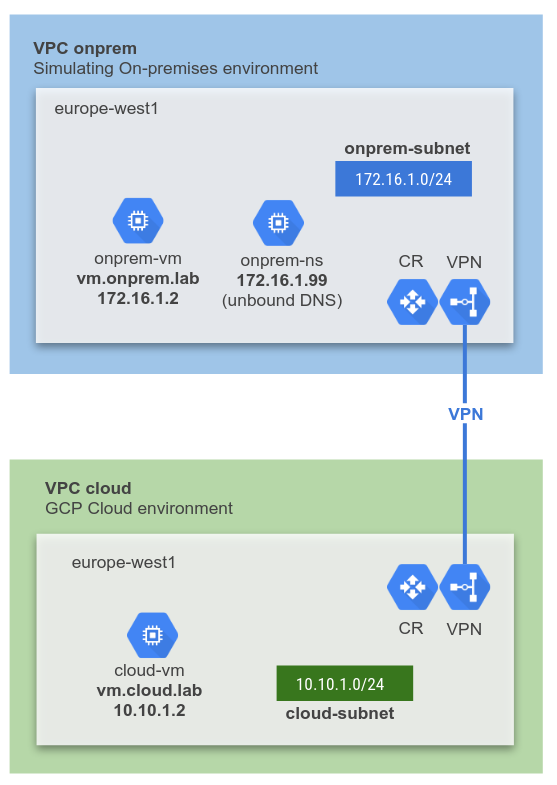

# LAB 2: Hybrid Private DNS
This terraform code deploys:
1. On-premises environment simulated in GCP
2. A GCP Cloud environment
3. HA VPN between on-premises and GCP
4. Private DNS on-premises using unbound
5. Private Cloud DNS in GCP
6. Resolving on-premises and GCP DNS queries bi-directionally



### Clone Lab
Open a Cloud Shell terminal and run the following command:
1. Clone the Git Repository for the labs
```sh
git clone https://github.com/kaysal/training.git
```

2. Change to the directory of the cloned repository
```sh
cd ~/training/codelabs/lab2-dns
```

## Deploy Lab

Rename the `sample.tfvars` file to `terraform.tfvars` and fill the values of variables in the file.

Run the following commands to deploy the infrastructure:
```hcl
terraform init
terraform plan
terraform apply
```
To destroy the infrastructure, run the command
```hcl
terraform destroy
```

## Requirements
- Terraform 0.12 required.
- Activate `Compute Engine API`
