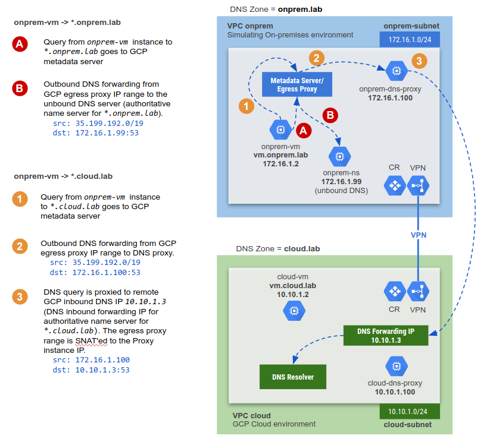
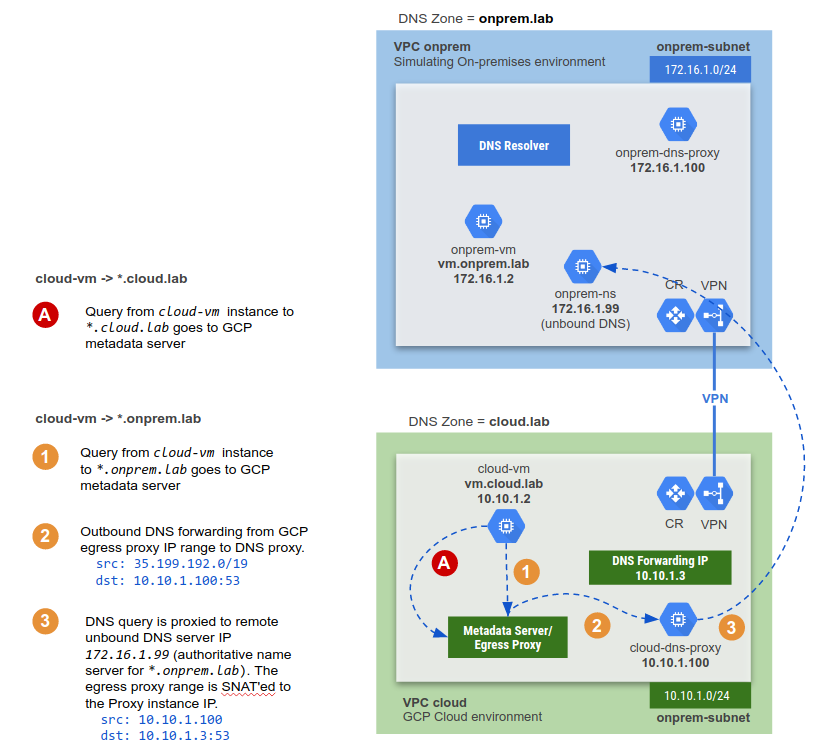

# LAB 2: Hybrid Private DNS

This terraform code deploys a bidirectional DNS setup between an on-premises environment (simulated on GCP) and a cloud environment. The on-premises environment uses unbound DNS. The lab consists of the following:
1. On-premises environment simulated in GCP
2. A GCP Cloud environment
3. HA VPN between on-premises and GCP
4. Private DNS on-premises using unbound
5. Private Cloud DNS in GCP
6. Resolving on-premises and GCP DNS queries bi-directionally


---

---

## Prerequisite
- Terraform 0.12 required.
- Activate `Compute Engine API`

### Clone Lab
Open a shell terminal and run the following command:
1. Clone the Git Repository for the labs
```sh
git clone https://github.com/kaysal/training.git
```

2. Change to the directory of the cloned repository
```sh
cd ~/training/codelabs/lab2-dns
```
3. Open the file `variables.txt` and locate the environment variable `export TF_VAR_project_id`. Replace the text `Paste your project ID here` with your Project ID. This configures the terraform environment variable `export TF_VAR_project_id` (`var.project_id`) with your project ID.

## Deploy Lab using Script (Recommended)
To deploy the infrastructure, run the following command:
```sh
./apply.sh
```
To destroy the infrastructure, run the following command:
```sh
./destroy.sh
```

## Deploy Lab Manually

1. Load the environment variables:
```sh
source variables.txt
```

2. Navigate, in the following order, into the directories to run terraform:
- `1-vpc`
- `2-instances`
- `3-router`
- `4-vpn`
- `5-dns`

In each directory, run the following commands to deploy the infrastructure:
```hcl
terraform init
terraform plan
terraform apply
```
To manually destroy the infrastructure, terraform must be executed in the directories in the following order:
- `5-dns`
- `4-vpn`
- `3-router`
- `2-instances`
- `1-vpc`

In each directory, run the following command to deploy the infrastructure:
```hcl
terraform destroy
```
