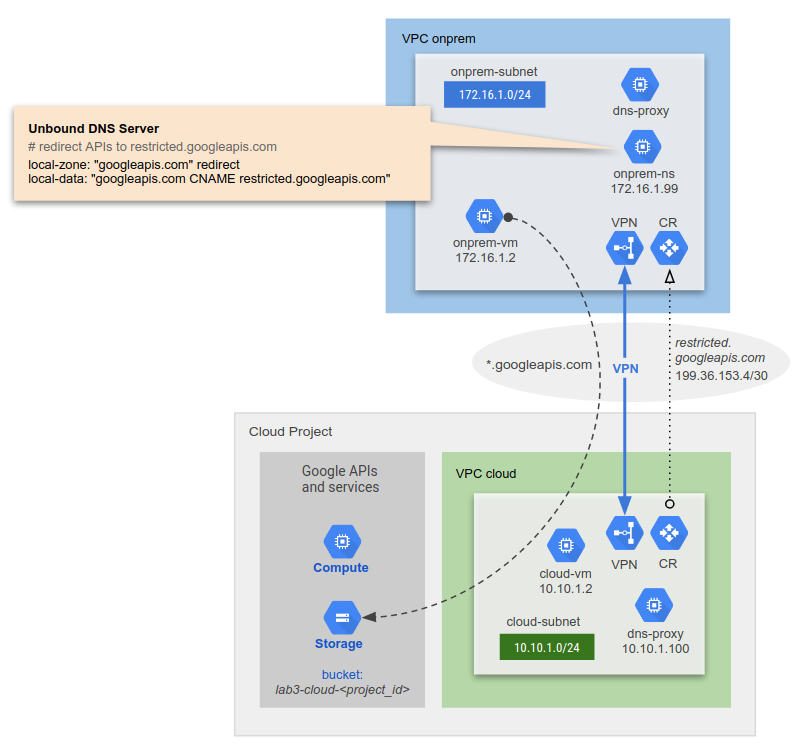

# LAB 3A: Private Google Access: From GCP and On-premises (Option A)

This terraform code deploys a Private Google Access setup between an on-premises environment (simulated on GCP) and a cloud environment.

DNS servers are configured to resolve \*.googleapis.com as a CNAME to restricted.googleapis.com; both on-premises and in GCP Cloud.

See `LAB 2: Hybrid Private DNS` which forms the basis of this lab. This lab includes additional Private Google Access in the GCP and On-premises environment.

The on-premises environment uses unbound DNS for both private DNS resolution and restricted.googleapis.com IP address range resolution for Private Google Access over the VPN. The lab consists of the following:
1. On-premises environment simulated in GCP
2. A GCP Cloud environment
3. HA VPN between on-premises and GCP
4. Private DNS and Private Google Access on-premises using unbound
5. Private Cloud DNS and Private Google Access in GCP
6. Google Cloud storage bucket with an object


---

## Prerequisite
- Terraform 0.12 required.
- Activate `Compute Engine API`

### Clone Lab
Open a shell terminal and run the following command:
1. Clone the Git Repository for the labs
```sh
git clone https://github.com/kaysal/training.git
```

2. Change to the directory of the cloned repository
```sh
cd ~/training/codelabs/lab3a-pga
```
3. Open the file `variables.txt` and locate the environment variable `export TF_VAR_project_id`. Replace the text `Paste your project ID here` with your Project ID. This configures the terraform environment variable `export TF_VAR_project_id` (`var.project_id`) with your project ID.

## Deploy Lab using Script (Recommended)

To deploy the infrastructure, run the following command:
```sh
./apply.sh
```
To destroy the infrastructure, run the following command:
```sh
./destroy.sh
```

## Deploy Lab Manually (Optional)

1. Load the environment variables:
```sh
source variables.txt
```

2. Navigate, in the following order, into the directories to run terraform:
- `1-vpc`
- `2-instances`
- `3-router`
- `4-vpn`
- `5-dns`
- `6-storage`

In each directory, run the following commands to deploy the infrastructure:
```hcl
terraform init
terraform plan
terraform apply
```
3. To manually destroy the infrastructure, terraform must be run in the directories in the following order:
- `6-storage`
- `5-dns`
- `4-vpn`
- `3-router`
- `2-instances`
- `1-vpc`

In each directory, run the following command to deploy the infrastructure:
```hcl
terraform destroy
```
