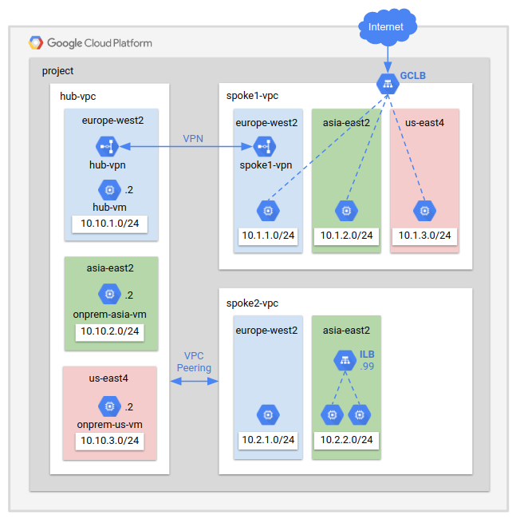

# LAB: Network Intelligence Centre

This terraform code deploys the architecture shown in the image below:


## Prerequisite
- Terraform 0.12 required.
- Activate `Compute Engine API` and other required APIs.

### Clone Lab
Open a Cloud Shell terminal and run the following command:
1. Clone the Git Repository for the labs
```sh
git clone https://github.com/kaysal/training.git
```

2. Change to the directory of the cloned repository
```sh
cd ~/training/codelabs/lab9-nic
```

## Deploy Lab

Set your project ID as an environment variable. Replace `[PROJECT_ID_HERE]` with your Project ID in the command below:
```sh
export TF_VAR_project_id=[PROJECT_ID_HERE]
```
To deploy the infrastructure, run the following command:
```sh
./apply.sh
```


Configure VPC peering between hub-vpc and spoke2-vpc to import and export custom routes. Replace `[PROJECT_ID_HERE]` with your Project ID in the command below:
```sh
export PROJECT_ID=[PROJECT_ID_HERE]
gcloud beta compute networks peerings create hub-to-spoke2 \
  --network hub-vpc \
  --peer-network spoke2-vpc \
  --peer-project ${PROJECT_ID} \
  --import-custom-routes \
  --export-custom-routes

gcloud beta compute networks peerings create spoke2-to-hub \
  --network spoke2-vpc \
  --peer-network hub-vpc \
  --peer-project ${PROJECT_ID} \
  --import-custom-routes \
  --export-custom-routes
```

## Delete Lab
To destroy the infrastructure, run the following command:
```sh
./destroy.sh
```
